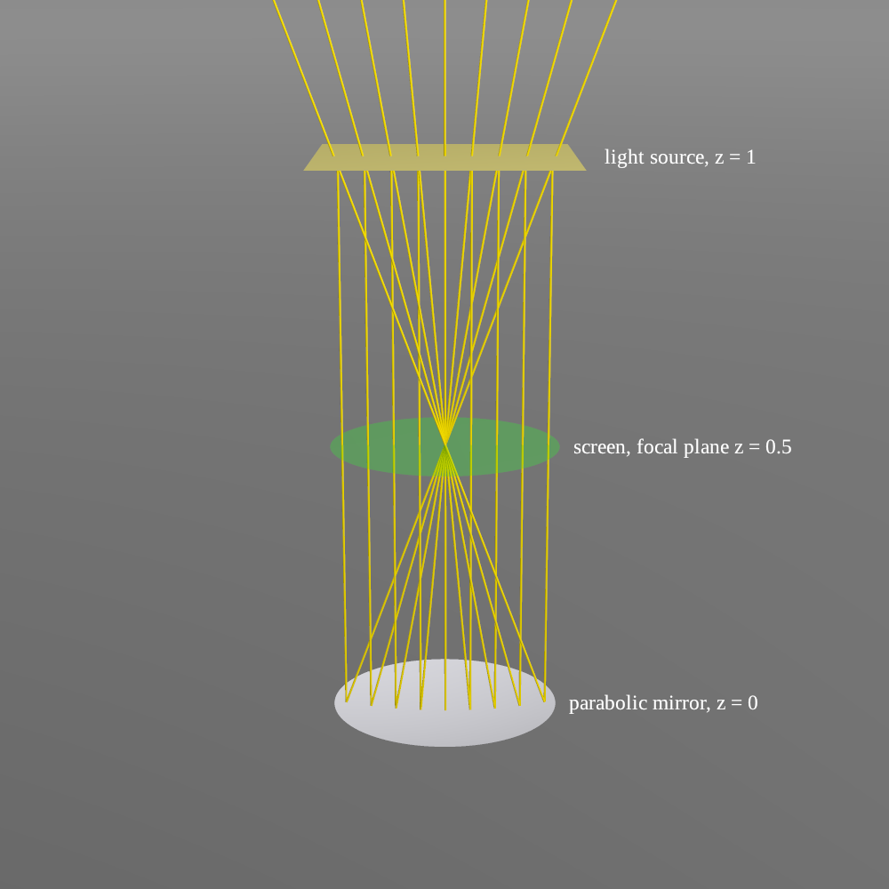
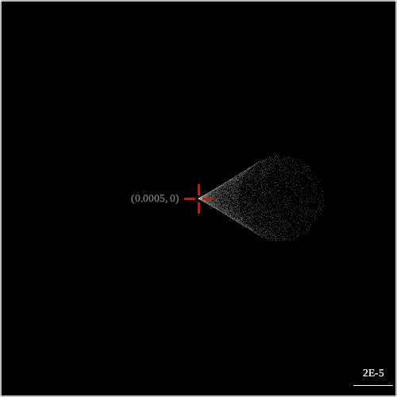
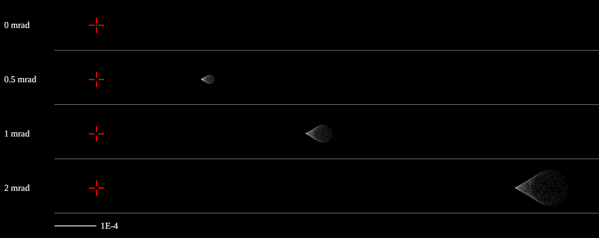

# Coma

Program: `Examples/coma.cpp`, built as `coma`.

A parabolic mirror brings a beam parallel to its axis to a perfect focus. Tilt the beam by as little as a milliradian, though, and the image in the focal plane is no longer a point: it spreads into a comet-shaped flare. This is coma, and it is why stars near the edge of the field of a Newtonian telescope grow "tails".

This example reproduces coma by ray tracing and compares the result with third-order aberration theory.

## Setup



*Made by `coma comaSetup`. A collimated beam leaves the light source (yellow), is reflected by the parabolic mirror and focuses on the screen (green) in the focal plane, then spreads out again. The yellow lines are 9 rays traced by the engine. The mirror's smooth, reflecting side (silver) faces up; its rough back is dark grey.*

The mirror looks flat because it is: its depth at the edge is D²/(16f) = 0.4² / (16 × 0.5) = 0.02, only 5% of its 0.4 diameter. The picture is at true scale; real telescope mirrors are flatter still.

Coordinates: the optical axis is +z and the mirror's vertex is at the origin. Everything is built by `addComaScene(en, d)`, where `d` is the tilt of the beam in radians.

| Part | Code | Parameters | Role |
|---|---|---|---|
| Mirror | `quadricSurface(shape = Parabola)` | vertex (0,0,0), axis +z, `radius = 1` | paraboloid x² + y² = 2Rz with vertex radius of curvature R = 1, so **focal length f = R/2 = 0.5** |
| Aperture | `quadricBound(shape = Tube)` | radius `qRadius = 0.2` | cuts the mirror to a disc of diameter **D = 0.4**; focal ratio **N = f/D = 1.25** |
| Mirror surfaces | `innerReflectType = Mirror`, ... | inner reflectance 1, outer 0 | the upper side is a perfect mirror; the back absorbs |
| Source position | `planePositionSampler` | plane z = 1, n1 = (0,1,0), n2 = (1,0,d) | emits uniformly over a 0.44 × 0.44 square, 10% wider than the mirror (`s = 1.1`), so the whole mirror is lit |
| Source direction | `cosineDirectionSampler(0.00)` | half-angle 0 | every ray leaves along the plane's normal (d, 0, −1): a **collimated beam tilted by d**, i.e. a star at infinity, d off the axis |
| Spectrum | `monoSpectrum(600.)` | 600 nm | a mirror has no chromatic aberration, so the wavelength does not matter |
| Screen | `PlaneScreen("screen")` | z = 0.5 (**focal plane**), same aperture as the mirror | fully transparent (`refractRatio = 1`) so it blocks nothing; `recordOut2In = false` records only rays crossing it upwards after the mirror |
| Floor | `PlaneScreen("floor")` | z = 0 | reflectance 0: absorbs the light that misses the mirror (the square source is wider than the round mirror); it is the grey background in the setup picture |
| Rays | `en.emit(10000)` | 10,000 | |

`comaSpot` uses d = 1E-3, i.e. 1 mrad.

The source's n1 range also carries an offset of −d·z = −1E-3, negligible next to its 0.22 half-width.

## Results

### The spot in the focal plane



*`coma_spot.png`: a 2E-4 × 2E-4 window of the screen centred on (5E-4, 0), 500 × 500 pixels, with a grey frame at its edge. The red cross at its centre is the chief ray's image point (0.0005, 0); the bar at the bottom right is 2E-5 long.*

- The **tip** is where the chief ray (the one through the centre of the mirror) lands: x = f·θ = 0.5 × 1E-3 = 5E-4, the ideal image point.
- The spot opens **away from the axis** (+x) as a wedge of about 60° capped by a round head, the classic shape of coma.
- The tip is the brightest part: most of the light lands near the chief ray, while rays from the rim of the mirror land farthest out and are spread widest.

### Coma against field angle



*Made by `coma comaVsAngle`. One row per field angle (0, 0.5, 1 and 2 mrad). Every row shows the same window of the screen, x from −1E-4 to 1.2E-3, so each spot sits where it really lands. The red cross is the centre of the screen, on the optical axis; the bar is 1E-4.*

- **0 mrad**: a single point at the centre of the screen. On axis the paraboloid has no aberration.
- The spot moves away from the axis as the angle grows: its tip lands at x = f·θ (2.5E-4, 5E-4 and 1E-3).
- Doubling the angle also doubles both the length and the width of the spot: **coma grows linearly with field angle**.

### Comparison with theory

Third-order coma of a paraboloid:

- tangential coma (length of the spot) L = 3θf / (16N²)
- width of the spot = 2L/3

Sizes measured from the spots:

| Field angle θ | Measured length | Theory | Measured width | Theory |
|---|---|---|---|---|
| 0.5 mrad | 3.2E-5 | 3.0E-5 | 2.2E-5 | 2.0E-5 |
| 1 mrad | 6.3E-5 | 6.0E-5 | 4.4E-5 | 4.0E-5 |
| 2 mrad | 1.26E-4 | 1.2E-4 | 8.6E-5 | 8.0E-5 |

The measured sizes are about 5% above third-order theory. At f/1.25 the mirror is fast, and the higher-order terms the formula leaves out are of that size, so the difference is expected.

For reference, the diffraction limit at 600 nm and f/1.25 (Airy radius 1.22λN) is about 9E-7, two orders of magnitude below the coma at 1 mrad. This is geometric ray tracing and does not include diffraction.

## Running

```bash
mkdir run && cd run
../build/coma                   # all three examples
../build/coma comaSpot          # only coma_spot / coma_floor / coma_devices
../build/coma comaVsAngle       # only coma_vs_angle.png
```

Pictures are written to `output/` in the current directory. `Examples/reference/` holds reference outputs to compare against.

| Example | Output | Time |
|---|---|---|
| `comaSpot` | `coma_spot.png`, `coma_floor.png`, `coma_devices.png` | about 1 s |
| `comaSetup` | `coma_setup.png` | about 15 s |
| `comaVsAngle` | `coma_vs_angle.png` | under 1 s |

Ray tracing samples randomly, so the noise differs from run to run, but the shape and size of the spots do not.
