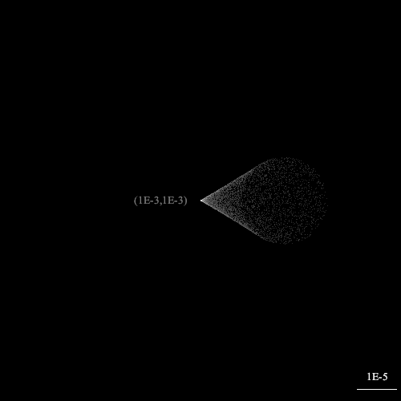
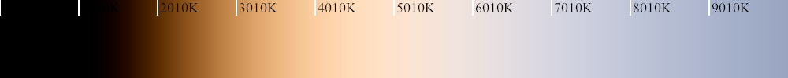
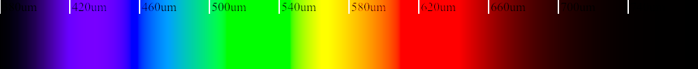
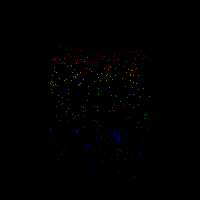
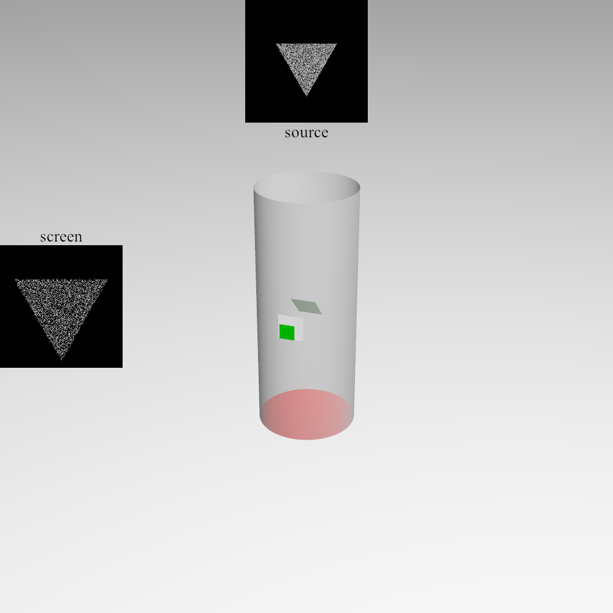
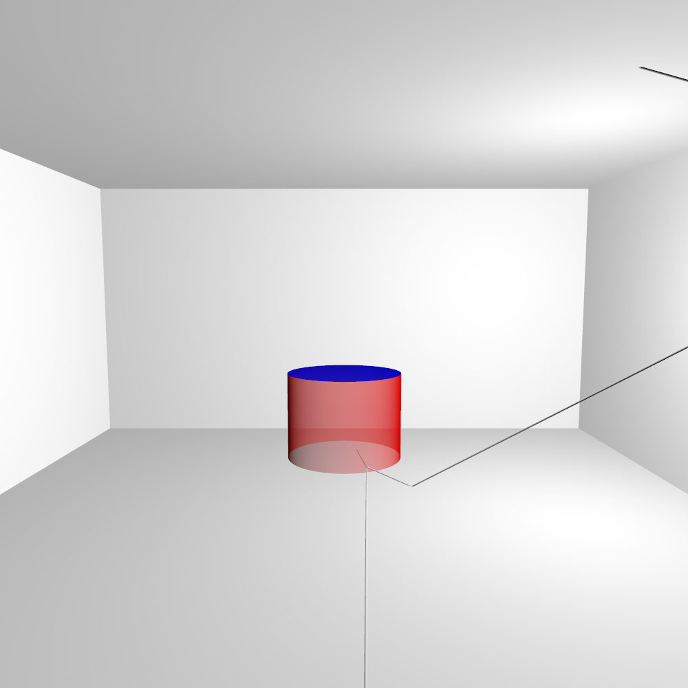
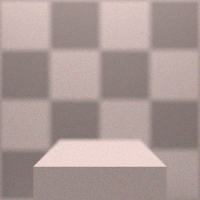

# srt
Simple Ray Tracing For Study

# Pictrues

# comma

# temperature to color

# wavelength to color

## dispersive Prism

## telescope

## raytracing for ray

#  camera to light ray tracing for picturing.

## From left to right: diffusive sphere, silver sphere, galss sphere, metal sphere.

## depth of view for box

